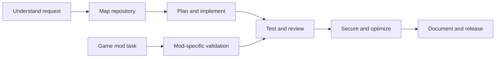

# GhosTnever Mega Toolkit

An all-in-one Codex plugin with 21 focused skills for building, reviewing, securing, and releasing software. Each skill activates for a specific kind of task and gives Codex a practical workflow, checks, and reporting format.

## Included skills

| Area | Skills |
| --- | --- |
| Understand and plan | Repository Tour, Feature Planning, Implementation Workflow |
| Build and debug | Bug Hunting, Test Engineering, Python Engineering, TypeScript and Node.js Engineering |
| Review and reliability | Change Review, Secure Code Review, Dependency Audit, Performance Analysis, CI Failure Triage, Incident Response |
| Design and UX | API Design, Database Migrations, Accessibility Audit, Product Usability Review |
| Ship and maintain | GitHub Actions, Release Readiness, Docs from Code |
| Modding | Game Mod Support |

## How the skills fit together


## Install in Codex

Add the [GhosTnever Codex Toolkit marketplace](https://github.com/GhosTnever-lkm/ghosTnever-codex-toolkit) and install `ghostnever-mega-toolkit` from the plugin browser. With the CLI:

```powershell
codex plugin marketplace add https://github.com/GhosTnever-lkm/ghosTnever-codex-toolkit.git --ref main
codex plugin add ghostnever-mega-toolkit --marketplace ghosTnever-codex-toolkit
```

## How it works

The plugin contains instruction-only skills: it adds no background service, external account connection, or network permission. Codex selects a relevant skill from the user's request. Review-oriented skills are read-only by default; editing, release, deployment, and external publishing still follow the user's request and repository guidance.

## ☕ Support / Pro Version

The toolkit is free and open source under the MIT License. Optional support: [Boosty](https://boosty.to/azizazimov) · [Buy Me a Coffee](https://www.buymeacoffee.com/azizazimov8) · [Gumroad](https://azimovian22.gumroad.com/). There is no paid Pro edition for this plugin at this time.

## License

MIT. See [LICENSE](LICENSE).
